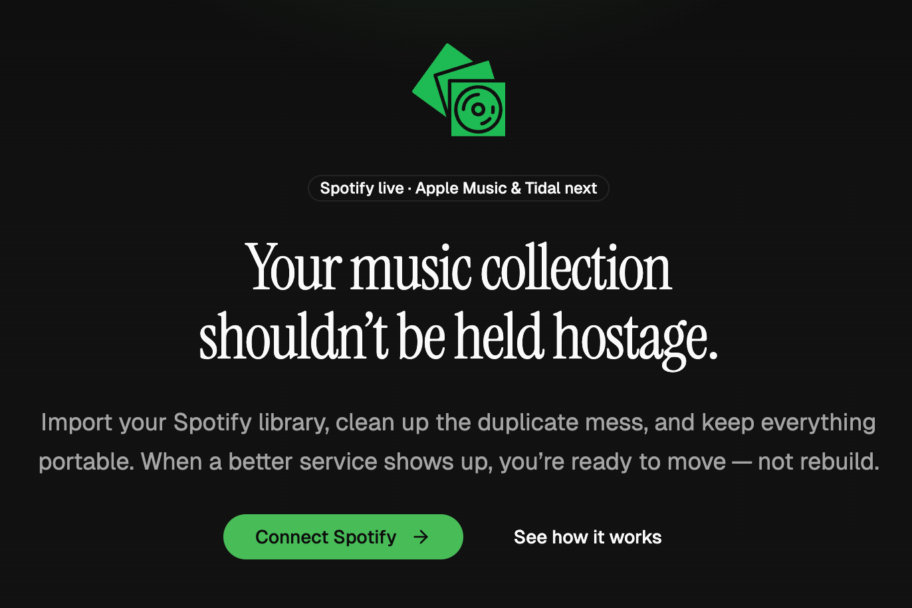

I have been a Spotify user for years. Saved tracks, finely tuned playlists, daily mixes that finally figured me out. Useful, until I wonder what would happen if I wanted to leave. The honest answer is, I would lose almost everything.

That is the problem [OneMusicCrate](https://onemusiccrate.aaronmolina.me/) is here to solve.

## The pitch

Your music collection should not be held hostage by the streaming service you happen to use today. OneMusicCrate imports your Spotify library, helps you clean up the duplicate mess, and keeps everything portable. When a better service shows up, you are ready to move, not rebuild.

Spotify is the first integration. The schema is already designed for Apple Music and Tidal next.

## Why this stack

I wanted a small, modern full-stack project that I could actually use, not a tutorial app. Here is what I picked and why.

### Next.js 16 with the App Router

Server Components and Server Actions cover most of the data layer for an app like this. I did not want to maintain a separate API surface for what is essentially user-facing CRUD over a Spotify dataset.

### better-auth

I needed three sign-in paths in one place: email plus password, magic link, and Spotify OAuth. better-auth handles all three on one session model. Adding Apple Music OAuth later is configuration, not a rewrite.

### Drizzle on PostgreSQL

Types flow from the schema all the way to the UI. A column change produces compile errors across the codebase. That kind of feedback loop is hard to give up once you have it.

### TanStack Query and TanStack React Virtual

React Query handles caching, background refetching, and optimistic updates. React Virtual rescued the library table when I tested it against my real Spotify account, which is a few thousand tracks deep.

### shadcn/ui on Base UI

A small set of primitives, full control over styling, and no third-party design system to fight. Tailwind v4 handles the rest.

## Two issues worth writing down

### The library table fell over at 3,000 tracks

The first version of the library page rendered every track in the DOM. On a small test library it was fine. On my real library, first paint took noticeably longer and scrolling stuttered.

The fix was virtualization. I rewrote the table around `@tanstack/react-virtual` so only the visible rows plus a small overscan buffer are rendered. The table now feels the same whether the user has three hundred tracks or thirty thousand.

### A Set Password button that did nothing

This one was a small bug with a sneaky cause. The Set Password form on the account page would not submit when the button was clicked. No errors, no network call, just nothing.

The shadcn Button is built on the Base UI Button primitive, which defaults to `type="button"`. Inside a form, that means the click never reaches the submit handler. Adding `type="submit"` explicitly to the submit button fixed it. I now treat that as a project rule for any Base UI button placed inside a form.

## What I learned

A few things stuck with me while building this.

**Auth is still where most of the friction is.** better-auth made the auth layer feel boring in a good way, but I still spent more time thinking about session edges, token refresh, and connected service state than I expected.

**The Spotify Web Playback SDK is more powerful than I thought.** Adding inline playback turned the app from a library viewer into something I actually want to keep open.

**Designing for portability changes the schema.** Once you accept that Spotify is one of several sources, the data model gets cleaner, not messier. The cost of doing that on day one was small. Retrofitting it later would have been painful.

## What is next

A few things on the list.

- **Apple Music and Tidal imports**, since the schema is already shaped for them
- **Smarter duplicate detection** that considers track length, ISRC, and live versus studio versions, not just title and artist
- **Library export**, so you can take your cleaned-up library out as a portable file you actually own

If you want to try it, [OneMusicCrate is live](https://onemusiccrate.aaronmolina.me/). Connect Spotify, browse your library, and see how many duplicates you have been ignoring for years.
