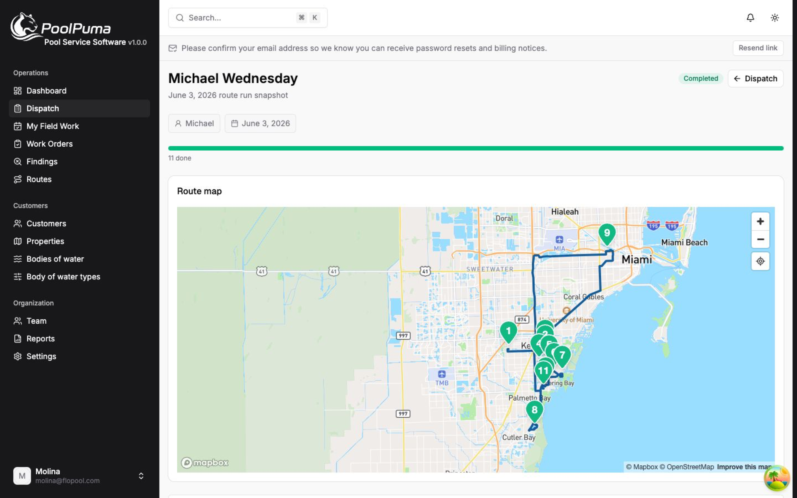

For most of my career the default backend answer was Node and Express. You reach for it without thinking, the way you grab the same coffee mug every morning. It works, everyone knows it, nobody questions it.

When I started building [PoolPuma](https://poolpuma.com), a pool service management app, I decided not to run on autopilot. The API on that project runs on Bun with Hono instead. This is the honest version of why, including the parts that were annoying.

## What PoolPuma's backend actually has to do

Some context first, because "which runtime" only matters relative to the job.

PoolPuma's API is one backend feeding three clients: a React web app for owners, a native SwiftUI macOS app, and an Expo iPhone app for the techs in the field. It handles auth, Stripe billing, Postgres through Drizzle, proof-photo uploads to object storage, and some optional AI route ordering. It is not a toy, and it is not Google scale either. It is a real product with a real database and paying-plan logic.

That middle ground is exactly where the Bun and Hono decision gets interesting.

## Why Bun

The pitch for Bun is speed, but that is not really what sold me. Fast startup is nice. What I actually kept enjoying was that Bun just does the stuff I used to bolt on.

### TypeScript runs directly

No `ts-node`, no separate build step to run the thing locally, no `tsconfig` gymnastics to get a dev server going. I point Bun at a `.ts` file and it runs. On a TypeScript-heavy codebase that flows types from Drizzle all the way out to the clients, cutting the transpile-to-run friction added up over a hundred small dev-loop moments a day.

### The test runner is built in

Bun ships a test runner that is fast and needs almost no config. PoolPuma has a decent test suite, including database-backed tests and a suite that pins operator role redaction so field techs can never see client billing. I did not want to stand up Jest or Vitest and wire up all the ceremony. `bun test` was there, it was quick, and I moved on.

### It is a package manager too

`bun install` is fast enough that I stopped resenting dependency installs. In a Turborepo monorepo with multiple apps and shared packages, that speed shows up constantly.

## Why Hono

Bun is the runtime. Hono is the framework sitting on top, and honestly it is the piece I would recommend the fastest.

### Small and explicit

Express accumulates middleware. You start with a clean file and six months later there is a stack of `app.use()` calls nobody fully remembers the ordering rules for. Hono stays small. The routing is clean, the context object is typed, and I can read a route handler and know exactly what touches the request.

### Validation that matches my contracts

PoolPuma keeps its roles, DTOs, and API contracts in a shared workspace package, so every client validates against the same source of truth. Hono's `zod-validator` middleware lets the API validate incoming requests against those same Zod schemas. The thing checking the request at the door is the same thing the clients build against. That alignment is worth a lot when a Swift app and a React Native app both hit the same endpoint.

### It runs anywhere

Hono is not tied to Bun. It runs on Node, Bun, Deno, and edge runtimes. That mattered to me as an escape hatch. If Bun ever became a problem in production, moving the HTTP layer to Node would not be a rewrite. That portability made the whole bet feel less risky.

## Where it bit me

I am not going to pretend it was all smooth.

The ecosystem is smaller. Every so often I hit a library that assumed Node internals, and I had to check whether Bun supported the specific API before committing. Better Auth worked cleanly with its Drizzle adapter, Stripe's SDK was fine, the AWS S3 client was fine. But I did that "does this run on Bun" check more than once, and on Node I would never think about it.

Deployment took a beat of care too. Bun in production is solid now, but it is newer, so I paid attention to the runtime version and the readiness checks instead of copying a Node Dockerfile I had used ten times before.

None of it was a dealbreaker. It was the tax you pay for not being on the most-traveled road.

## Who should still use Node

I am not here to tell you Express is dead. If your team already knows Node cold, if you depend on a library that leans on Node internals, or if you just want the boring choice that every deployment platform documents first, use Node. That is a completely defensible call and I have shipped plenty of production Node.

For PoolPuma, I wanted a fast dev loop, a small explicit HTTP layer, validation wired to my shared contracts, and an exit ramp if the runtime bet went sideways. Bun and Hono gave me all four. I would make the same choice again.

If you want to see what got built on top of it, the full writeup is here: [PoolPuma](/projects/poolpuma).
